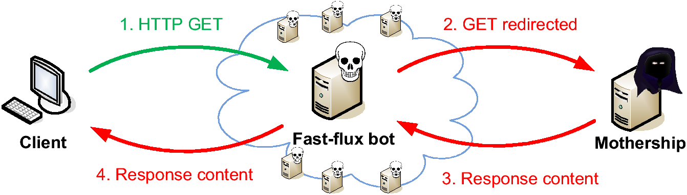
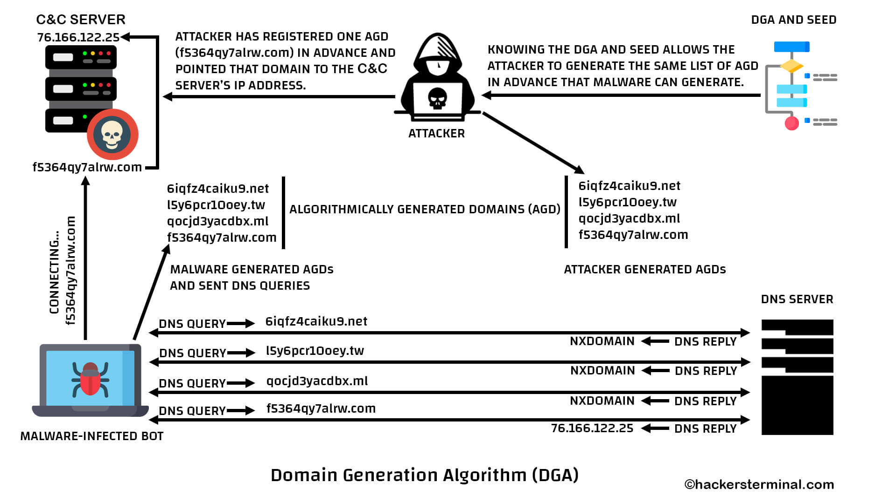

#

```
DNS舊技術新玩法 - Fast Flux
https://www.nccst.nat.gov.tw/ArticlesDetail?lang=zh&seq=1131

屍網路連接技術(下) - Domain-flux
http://download.icst.org.tw/attachfilearticles/%E6%AE%AD%E5%B1%8D%E7%B6%B2%E8%B7%AF%E9%80%A3%E6%8E%A5%E6%8A%80%E8%A1%93(%E4%B8%8B)%20-%20Domain-flux.pdf
```

# Fast-Flux




```
DNS舊技術新玩法 - Fast Flux
https://www.nccst.nat.gov.tw/ArticlesDetail?lang=zh&seq=1131

[1] The Honeynet Project & Research Alliance: 
    Know Your Enemy: Fast-Flux Service Networks (2007), 
    http://www.honeynet.org/papers/ff/fast-flux.html

[2] Holz, T., Gorecki, C., Freiling, F., Rieck, K.: 
    Measuring and Detecting of Fast-Flux Service Networks. 
    In: Proceeding of the 15th Annual Network & Distributed System Security Symposium (NDSS08). (February 2008)

[3] Fast flux foils bot-net takedown, http://www.securityfocus.com/news/11473/2

[4] Chenfeng Vincent Zhou, Christopher Leckie and Shanika Karunasekera, 
    Collaborative Detection of Fast Flux Phishing Domains, 
    JOURNAL OF NETWORKS, VOL. 4, NO. 1, FEBRUARY 2009

[7] Nazario, Jose & Thorsten Holz. As the Net Churns: 
    Fast-Flux Botnet Observations. Sept 5,2008

[8] Emanuele Passerini., Roberto Paleari., Lorenzo Martignoni., and Danilo Bruschi.: 
    FluXOR: detecting and monitoring fast-flux service networks. 
    Springer, July 10-11, 2008
    
    Zhou, C., Leckie, C., Karunasekera, S., Peng, T.: A self-healing, 
    self-protecting collaborative intrusion detection architecture to trace-back fast-flux phishing domains. 
    In: Proceedings of the 2nd IEEE Workshop on Autonomic Communication and Network Management (2008)
```

# DGA Domain generation algorithm



``` 
https://en.wikipedia.org/wiki/Domain_generation_algorithm
```
