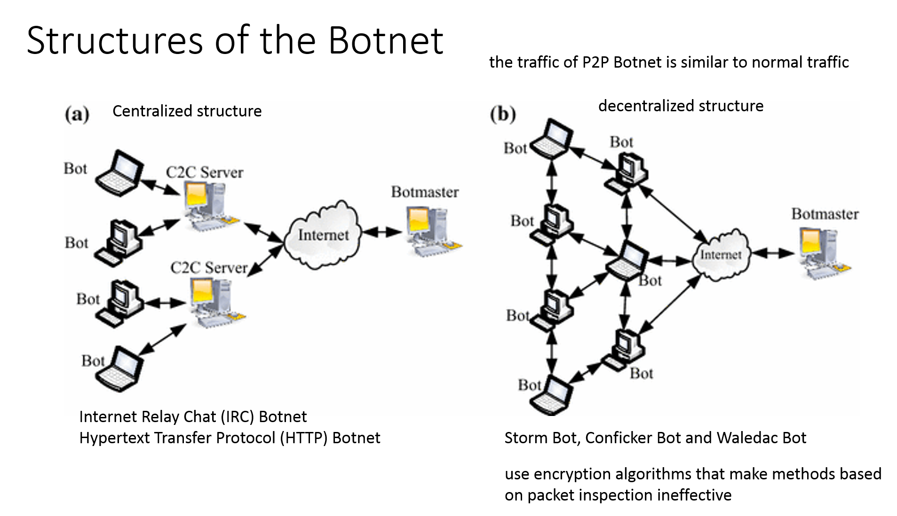

# BOTNET Detection and Prevention
```
Botnet 如何偵測？
黃能富 教授   國立清華大學資訊工程系   nfhuang@cs.nthu.edu.tw
```
# Botnet架構



# 要取那些流量特徵??
```
A P2P Botnet detection scheme based on decision tree and adaptive multilayer neural networks
Mohammad AlauthamanNauman AslamEmail authorLi ZhangRafe AlasemM. A. HossainNeural 

Computing and Applications
June 2018, Volume 29, Issue 11, pp 991–1004
https://link.springer.com/article/10.1007/s00521-016-2564-5
```
```
Selected features of network traffic connections

Features   Description
F1 Number of control packets per flow in a given time interval
F2 Number of control packets transmitted per flow in a given time interval
F3 Number of control packets received per flow in a given time interval
F4 Number of transmitting bytes per flow in a given time interval
F5 Number of received bytes per flow in a given time interval
F6 Number of transmitted SYN packets per flow in a given time interval
F7 Number of received SYN packets per flow in a given time interval
F8 Number of transmitted ACK packets per flow in a given time interval
F9 Number of received ACK packets per flow in a given time interval
F10 Number of transmitted duplicate ACK packets per flow in a given time interval
F11 Number of received duplicate ACK packets per flow in a given time interval
F12 Average length of transmitted control packets per flow in a given time interval
F13 Average length of received control packets per flow in a given time interval
F14 Average length of control packets per flow in a given time interval
F15 Number of transmitted failed connection per flow in a given time interval
F16 Number of received failed connection per flow in a given time interval
F17 Number of transmitted ACK packets have a sequence one per flow in a given time interval
F18 Number of received ACK packets have a sequence one per flow in a given time interval
F19 Number of transmitted SYN–ACK packets per flow in a given time interval
F20 Number of received SYN–ACK packets per flow in a given time interval
F21 Total number of bytes per flow in a given time interval
F22 Ratio of incoming control packets per flow in a given time interval
F23 Ratio of average length of outgoing packets over the average length of control packets per flow 
     in a given time interval
F24  F6–F20
F25  Number of transmitted FIN–ACK packets per flow in a given time interval
F26  Number of received FIN–ACK packets per flow in a given time interval
F27  Number of transmitted RST–ACK packets per flow in a given time interval
F28  Number of received RST–ACK packets per flow in a given time interval
F29  Average time between an attempt to create connection per flow in a given time interval
```
